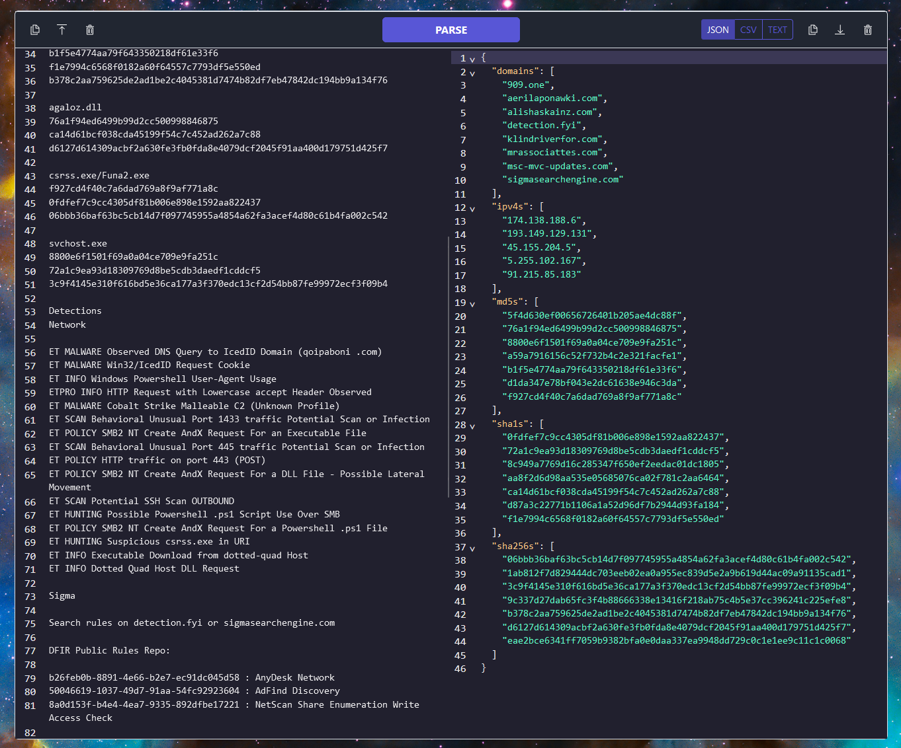

# CTI Goblin

Parse atomic indicators of compromise from any plain text source.

    

## The GUI

    

## Features

- Paste or upload plain text content.
- Parse and export the extracted indicators of compromise as JSON, CSV, or plain text.

## Usage

### Hosted

Access the hosted application [here](https://cti-goblin.vercel.app/)

### Local

1. Install [Node.js](https://nodejs.org/en)
2. Clone the repository
3. `cd cti-goblin`
4. `npm install`
5. `npm start`
