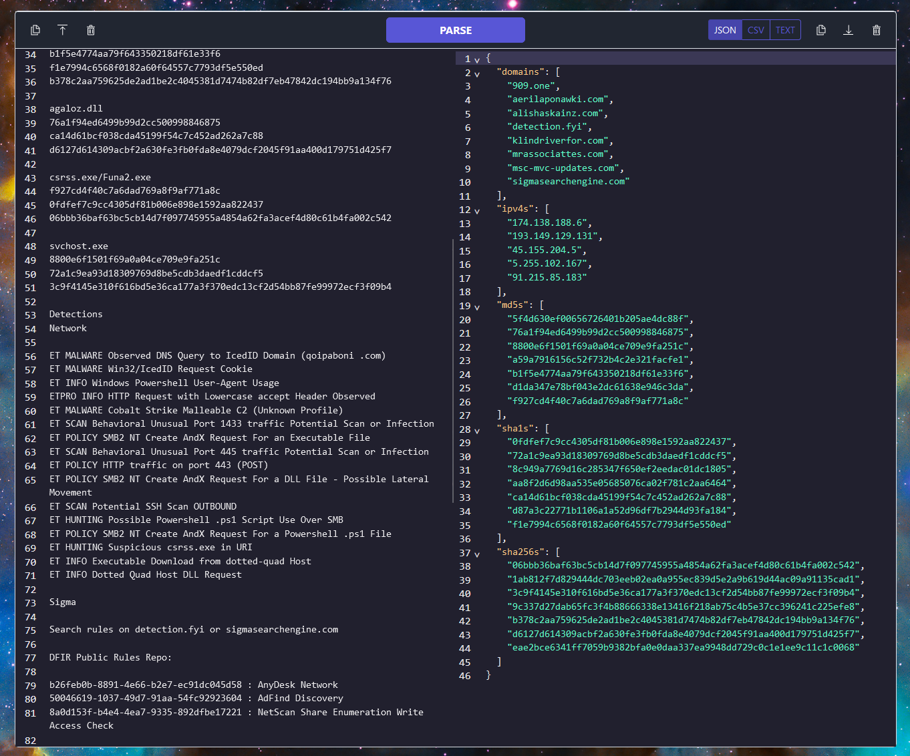

# CTI Goblin

Process indicators from Cyber Threat Intelligence reports. 

## Features

- Paste or upload CTI reports that contain atomic indicators. 
- Parse and export IOCs from your input as json, csv, or plain text.

## Usage

### Hosted

Access the hosted application [here](https://cti-goblin-c9774c16d608.herokuapp.com/)

### Local

1. Clone the repository
2. Install [Node.js](https://nodejs.org/en)
3. `cd cti-goblin`
4. `npm install`
5. `npm run dev`
